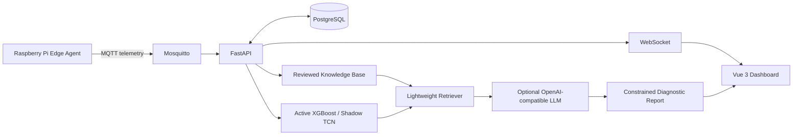
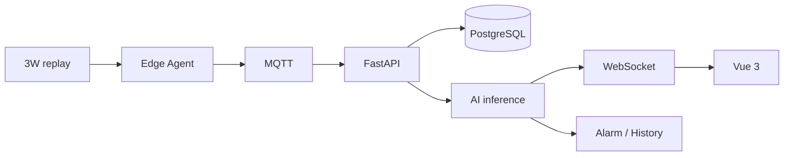
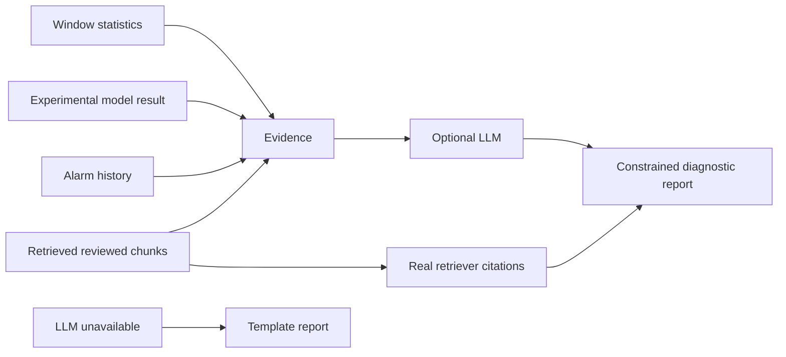

# 系统架构

## System Architecture

## Telemetry Data Flow

## Diagnosis Flow

知识检索目前只对 `docs/knowledge-base/manifest.json` 中的受审阅静态条目做关键词匹配；未实现文档上传、embedding、pgvector 或 FAISS 索引。LLM 不读取完整原始时序、不能生成控制命令，也不能新增引用；外部 API 不可用时保留模板报告，监控链路不受影响。
